# Coffee Blog

Coffee blog is a website aimed at coffee lovers, a place where they can share information about the world of coffee.
Users can create posts containing title, author, content and image, they can also update and delete their posts.

The live link can be found here - [Coffee Blog](https://coffee-blog-e58e366c1103.herokuapp.com/)

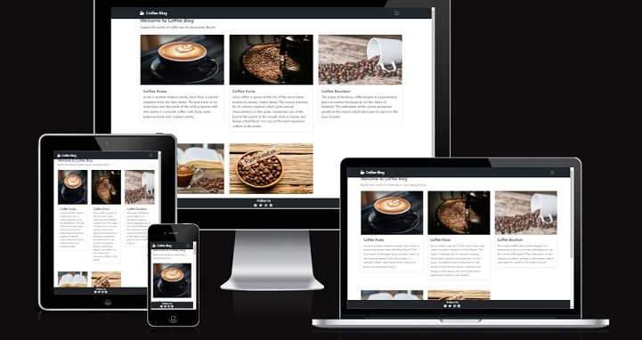

## UX

Following an Agile paradigm, user stories will target customer needs and reduce embellishments on the part of the developer.
Site user needs can be split into 3 categories or epics:

- Navigation
- Account management
- Post management
  

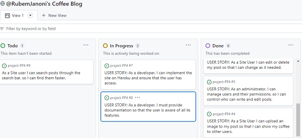

## Design

The design was planned to offer a clean, minimalist layout, with a white background and black navigation bar, highlighting the colors of the coffee images, the different shades of brown, harmoniously interacting with black and white.
As inspiration for the design and the choice of the color palette, we used the **Huemint** tool, where we could test various combinations and palette options.

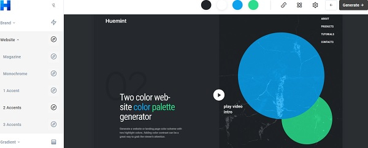

## Features

- Navigation

Navigation is quite simple, basically we have a menu on the left with the main features, containing three buttons (Register, Sign In, Sign Out, Home, All Posts, Create Post).

**Register** - Leads the user to the registration form, containing four input fields (**Username**, **Email**, **Password**, and **Password confirmation**). Upon completing the registration, the user is directed to the login page.
Also provides the user with the option to log in immediately if they already have an account.

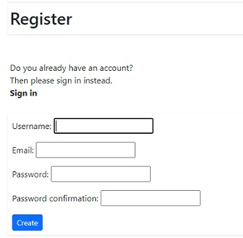

**Sign In** - Takes the user to the login page, requiring the completion of only two input fields (Username and Password). After logging in, a Bootstrap alert confirming the successful login is displayed. The alert automatically disappears after 5 seconds through the use of the JavaScript **setTimeout** function.

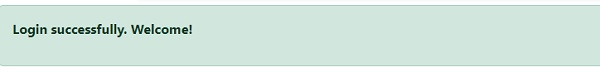

**Sign Out** - Redirects the user to the logout page, displaying a Bootstrap alert confirming the logout. It also provides the user with the option to log in again.

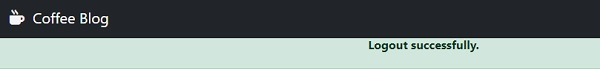

**Home** - It always takes you to the home page, where the posts are displayed.

**All Posts** - Displays a list of posts, where it is possible to update or delete each post.

**Create Post** - Through this button, the user has access to the post form, with basically the author, text and upload image fields.

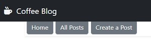

The **All post** and **Create Post** buttons take the user to the list of posts and the creation form respectively, as shown in the images below.

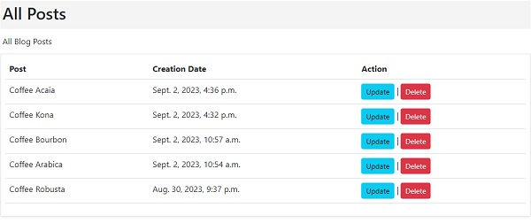

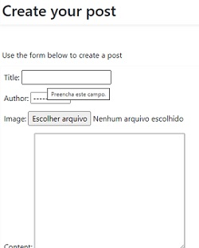

  On the right we have a hamburger menu, where user login and registration features are presented.
  The user will only be able to create, change and delete a post after registering and logging in.

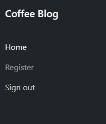

## The Header

A nav-brand was used in the header, showing the name of the site "Coffee Blog" and a logo, represented by a fontawosome icon.

## The Main Section

In the body of the website, posts are inserted, built within a bootstrap card structure, with all the required responsiveness and planned according to the must-have requirements of the agile model.

## The Footer

Following the same design pattern, the footer is presented, containing links to the main social networks, with their respective fontawesome icons.

## Testing

- I tested that this page works in different browsers: Chrome, Firefox, Safari.
- I confirmed that this project is responsive, looks good and functions on all standard screen sizes using the devtools device toolbar.
- I confirmed that the navigation, header, footer, forms are readable and easy to understand.
- I have confirmed that the form works

## Validator Testing

- HTML
  - No errors were returned when passing through the official W3C validator.
  
- CSS
  - No errors were found when passing through the official (Jigsaw) validator.

   
    
- ACCESSIBILITY
  - I confirmed that the colors and fonts chosen are easy to read and accessible by running it through lighthouse in devtools.

  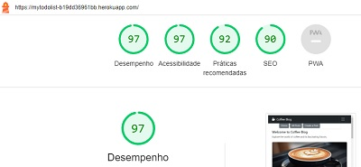         
         
    

## Deployment

This epic is the deployment of the application to Heroku - application parameters and configuration of heroku

USER-STORY: - As a developer, I must deploy to heroku to allow public access

Deployment to Heroku
Navigate to the heroku website and create an account if you dont have one.

Create a new app

Give it a name and select your region

Create app

Go to resources, and add Heroku postgres as an add-on, select the price plan that you desire.

Click on settings, and reveal config vars.

The following vars must be defined...

DATABASE_URL should have been populated by heroku

EMAIL_HOST_USER - is the sendng email address for user email verification (from signup).

EMAIL_HOST_PASS - is the sendng email address password for user email verification (from signup).

HEROKU_HOSTNAME - is the url which the app is deleivered by.

SECRET_KEY - is a string that the django application needs to run.

Go to the Deploy tab.

Connect to GitHub, sign in and connect to the required repository.

Scroll down to manual Deploy, select the main branch, and click deploy.
  
  
The live link can be found here - [Coffee Blog](https://mytodolist-b19dd36961bb.herokuapp.com/)

## Credits

### Media

- The images was taken from [Pexels](https://www.pexels.com/pt-br/).

- The icons was taken from fontawesome.

  

    
 
    
    

         

