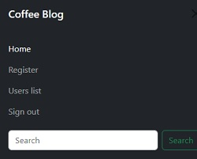

# Coffee Blog

Coffee blog is a website aimed at coffee lovers, a place where they can share information about the world of coffee.
Users can create posts containing title, author, content and image, they can also update and delete their posts.

## Features

- Design

The design was planned to offer a clean, minimalist layout, with a white background and black navigation bar, highlighting the colors of the coffee images, the different shades of brown, harmoniously interacting with black and white.

- Navigation

Navigation is quite simple, basically we have a menu on the left with the main features, containing three buttons (Home, All Posts, Create Post)

**Home** - It always takes you to the home page, where the posts are displayed.

**All Posts** - Displays a list of posts, where it is possible to update or delete each post.

**Create Post** - Through this button, the user has access to the post form, with basically the author, text and upload image fields.

The **All post** and **Create Post** buttons take the user to the list of posts and the creation form respectively, as shown in the images below.

  On the right we have a hamburger menu, where user login and registration features are presented.
  The user will only be able to create, change and delete a post after registering and logging in.

## The Header

A nav-brand was used in the header, showing the name of the site "Coffee Blog" and a logo, represented by a fontawosome icon.

## The Main Section

In the body of the website, posts are inserted, built within a bootstrap card structure, with all the required responsiveness and planned according to the must-have requirements of the agile model.

## The Footer

Following the same design pattern, the footer is presented, containing links to the main social networks, with their respective fontawesome icons.

## Testing

- I tested that this page works in different browsers: Chrome, Firefox, Safari.
- I confirmed that this project is responsive, looks good and functions on all standard screen sizes using the devtools device toolbar.
- I confirmed that the navigation, header, footer, forms are readable and easy to understand.
- I have confirmed that the form works

## Validator Testing

- HTML
  - No errors were returned when passing through the official W3C validator.
  
- CSS
  - No errors were found when passing through the official (Jigsaw) validator.

    

        
    

    
- ACCESSIBILITY
  - I confirmed that the colors and fonts chosen are easy to read and accessible by running it through lighthouse in devtools.  
         
     
    
    
### Unfixed bugs

No unfixed bugs

## Deployment

- The site was deployed to GitHub pages. The steps to deploy are as follows:
  - In the GitHub repository, navigate to the Settings tab.
  - From the source section drop-down menu, select the Master Branch.
  - Once the master branch has been selected, the page will be automatically refreshed with a detailed ribbon display to indicate the successful deployment.
  
  
The live link can be found here - [Life Yoga Club](https://rubemjanoni.github.io/code-project01/)

## Credits

### Content

- The code to make the social media links was taken from the CI [Love Running](https://code-institute-org.github.io/love-running-2.0/index.html) project.

### Media

- The background image was taken from [Pexels](https://www.pexels.com/pt-br/).

- The video in the gallery was taken from Youtube.

- The audio in the Home was taken from [Bensound](https://www.bensound.com/)

    
 
    
    

         

